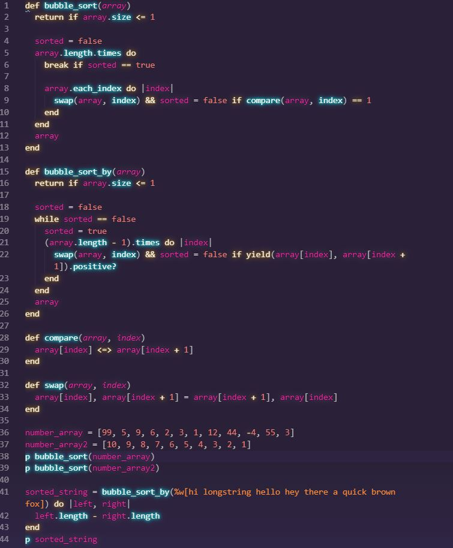
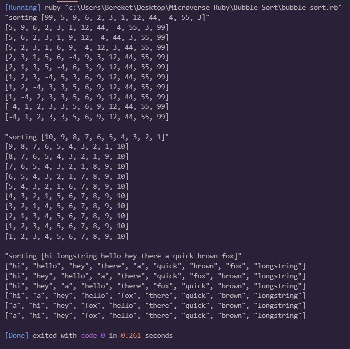

# Bubble Sort with Ruby
The aim of this first Ruby project is for us to start learning about the Ruby syntax.
  1. The first method sorts an array of numbers in ascending order.
  2. The second method accepts a block and sorts it by string length using yield.

## Built With

- Ruby
- Rubocop

### Prerequisites

- Ruby must be Installed (Windows PC)
- Basic command line knowledge

### Setup

- Download or clone the repository
- Run a CLI and run `ruby bubble_sort.rb` on your local machine
- Additionally, You can go to https://repl.it and select language ruby, copy paste the code, and run it.

## Author

👤 **Adan Fernandez Bonilla**

- Github: [@balerum03](https://github.com/balerum03)
- Twitter: @balerum03
- Linkedin: https://www.linkedin.com/in/adan-fernandez-bonilla-4560831a5

👤 **Bereket Beshane**

- Github: [@berabjesus](https://github.com/Berabjesus)
- Twitter: [@bereket_ababu_b](https://twitter.com/bereket_ababu_b)
- Linkedin: [linkedin](https://www.linkedin.com/in/bereket-beshane-a1b75a1a9/)

## 🤝 Contributing

Contributions, issues and feature requests are welcome!

Feel free to check the [issues page](https://github.com/Berabjesus/Bubble-Sort/issues).

## Show your support

Give a ⭐️ if you like this project!

## Acknowledgments

- Microverse
- GitHub
- TheOdinProject
- Ruby

## 📝 License

This project is [MIT](LICENSE) licensed.